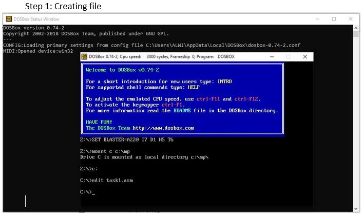
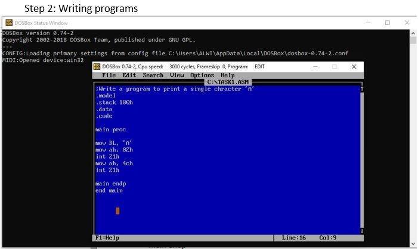
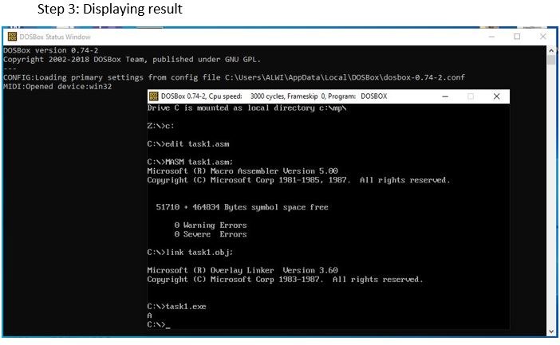

Title: Assembly Language 1
Date: 2021-04-23 02:50 PM
Category: Assembly
Authors: Alwi

## Objective: Write a program to print a single character ‘A’.

## ource Code
```
.model	        // It is an assembler directive that specifies the size of the program
.stack 100h		// It declares size of stack
.data			// In this segment variables are declared 
.code			// It is code segment directive

main proc		// main procedures start from here

mov DL, 'A'		// ‘A’ is moving to Data Register
mov ah, 02h		// Service Routine is being defined here to print the character
int 21h		    // Programs are returned to windows from DOS
mov ah, 4ch		// Using 4ch service routine number to display
int 21h		    // Programs are returned to windows from DOS

main endp		// Main procedures end here
end main		// whole programs end here
```

## Output:


