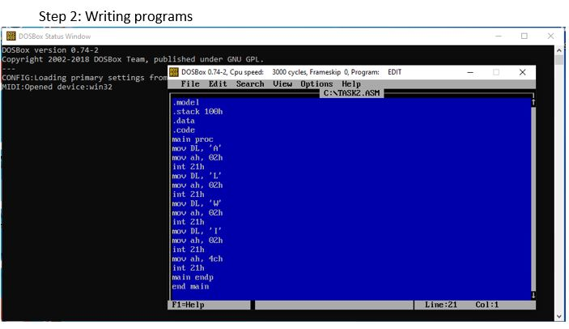

Title: Assembly Language 2
Date: 2021-04-23 03:02 PM
Category: Assembly
Authors: Alwi

## Objective: Write a program to print a string. (i.e. ALWI)

## ource Code:
```
.model  		// It is an assembler directive that specifies the size of the program
.stack 100h	    // It declares size of stack
.data			// In this segment variables are declared
.code			// It is code segment directive 

main proc		// main procedures start from here

mov DL, 'A'	    // 'A' is moving to Data Register
mov ah, 02h	    // Service Routine is being defined here to print the character to AH
int 21h		    // Programs are returned to windows from DOS

mov DL, 'L'	    // 'L' is moving to Data Register
mov ah, 02h	    // Service Routine is being defined here to print the character to AH
int 21h		    // Programs are returned to windows from DOS

mov DL, 'W'	    // 'W' is moving to Data Register>
mov ah, 02h	    // Service Routine is being defined here to print the character to AH
int 21h		    // Programs are returned to windows from DOS

mov DL, 'I'	    // 'I' is moving to Data Register
mov ah, 02h	    // Service Routine is being defined here to print the character to AH
int 21h		// Programs are returned to windows from DOS

mov ah, 4ch	    // Using 4ch service routine number to display
int 21h		    // Programs are returned to windows from DOS

main endp		// Main procedures end here
end main		// whole programs end here
```


## Output:


