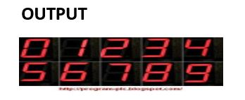

Title: Assembly Language 3
Date: 2021-04-23 03:07 PM
Category: Assembly
Authors: Alwi

## Objective: Write a program to display the digits in decimal from 0-7 in to 7-

## ource Code:
```
mov  al,80h          =>make  all  port
out  1f,al           =>out  80h  to  port
mov  al,00h          =>mov  0
out  19h,al          =>mov  0  to  port int  3
mov  al,f9h          =>mov  1
out  19h,al          =>mov  1  to  port int  3
mov  al,a4h          =>mov  2
out  19h,al          =>mov  2  to  port int  3
mov  al,b0h          =>mov  3
out  19h,al          =>mov  3  to  port int  3
............(so  on  to  9)
```


## Output:
