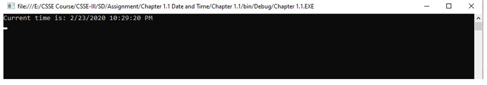

Title: C# Code 1
Date: 2021-04-23 03:28 PM
Category: C#
Authors: Alwi

## Objective 1: Write a program that prints on the console the current date and time.

## Source Code:
```C#
using System;
using System.Collections.Generic;
using System.Text;
using System.Threading.Tasks;

namespace Chapter_1._1
{
    //Write a program that prints on the console the current date and time.
    class Program
    {
        static void Main(string[] args)
        {
            Console.WriteLine("Current time is: "+DateTime.Now);

            Console.ReadLine();
        }
    }
}
```

## Output:
