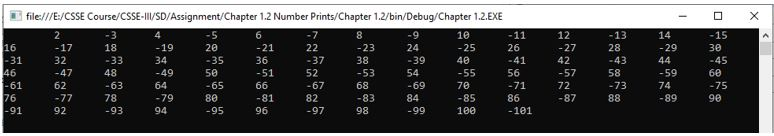

Title: C# Code 2
Date: 2021-04-23 03:32 PM
Category: C#
Authors: Alwi

## Objective 1: Write a program that prints the first 100 members of the sequence 2, -3, 4, -5, 6, -7, 8.

## Source Code:
```C#
using System;
using System.Collections.Generic;
using System.Linq;
using System.Text;
using System.Threading.Tasks;

namespace Chapter_1._2
{
    //Write a program that prints the first 100 members of the sequence 2, -3, 4, -5, 6, -7, 8.
    class Program
    {
        static void Main(string[] args)
        {
            for (int i = 2; i <= 100; i=i+2)
            {
                int j = (i + 1) * (-1);
                Console.Write("\t" + i);
                Console.Write("\t" + j);
            }
            Console.ReadKey();
        }
    }
}
```


## Output:
