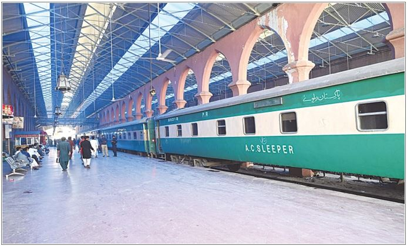
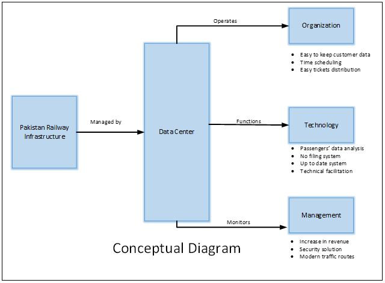
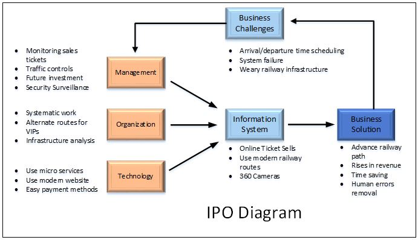

Title: Case Study 1
Date: 2021-04-22 15:46
Category: Case Study
Authors: Alwi

# PAKISTAN RAILWAY, TECHNOLOGICAL BOOST UP
## Overview:
Pakistan Railway is the national railway company of Pakistan which is state-owned established 15th August 1947, this headquarter is in Lahore. It owns 7791 km of tracks throughout the country from Torkham to Karachi. It tries to facilitate the people in a comfort mode.

 

## Challenges:
* Train arrival/departure schedule 
* Ticket distribution
* Train categories
* Weary Railway infrastructure
* Outdated Railway system
* Passengers data analysis
* Security system
* Railway route reconstruction
* Future advancement

 

## Enhancement in Pakistan Railway:
* For proper time schedule Pakistan Railway can use real time cloud-based database to manage time table all around the country. They also give passengers view permission to facilitate them. By this type of solution there should not be o crowed at railway stations as people already will know their timing scheme.
* Pakistan Railway should use a simple way to distribute tickets for this they are already using some online services but they have to provide such service which is easy to use for every person.
* They have to build more routes to provide facilitation categories like sometimes some people have to go anywhere urgently then they can easily reach their destination, this service also exists but due to less routes they are unable to facilitate people properly, so they should build more routes.
* Pakistan Railway infrastructure needs to be renovated as there are a lot of defects in it. 
* They also change their out-dated system and should move to modern digital infrastructure. They can use microservices to manage their customers data for future advancement.
* They can build mini restaurants inside the trains to facilitate the people.
* By using passengers’ data Pakistan Railway can provide the simple way in allocating the seats like whenever a passenger who travelled once can reserve the seat as he will find a filtered data.
* In current infrastructure passengers’ security is in a high risk, there is a big security issue. Pakistan Railway should use 360 high-definition cameras to monitor the people.
* Railway routes should be repaired as they are designed in old fashioned way, they should transform towards modern digital infrastructure.

 

