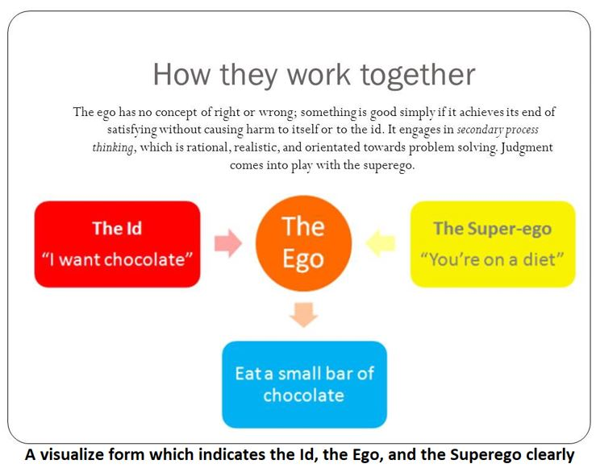

Title: Psychology 1
Date: 2021-04-23 03:14 PM
Category: Psychology
Authors: Alwi

# PERSONALITY

## Abstract
The purpose of this assignment is to give a discussion on personality development as an educational objective. A roadmap is designed in which personality is described as a high-level concept which refers to a person’s characteristic ways of interacting with the environment. I chose for the analysis of the environment on the development of the person’s internal representation.  
I described the personality as being an individual’s characteristic patterns of thinking, feeling and acting across a wide range of situations, the consistent features of the way they behave. It affects how we make decisions, solve problems, handle and deal with politics as well as cope with stress. Personality theory helps us to understand how others are different from us, despite similar experiences and situations. It also looks at how knowing and understanding your personality type can help you become a better individual.   
We will look at how personality varies among individuals as well as how people are similar. We will also assess, diagnose, and treat personality disorders. We also will find what exactly is personality? How can you gain insight into your emotional well-being?

## What is personality?
Personality means all of the thoughts, behavior patterns and social attitudes that impact how anyone views him/her self and what he/she believes about others and all around the worlds.  
Knowing of personality allows psychologists to predict how people will treat to certain events and the sorts of things they favor and value. To gain a sense of how researchers study personality psychology, it will find helpful to understand more about some of the most prominent personality theories.  
A lot of things would assert that what makes you unique is the characteristic levels of thoughts, feelings, thinking and behaviors that build up your personality. As there’s no one agreed-upon definition of personality, it is typically thought of as one thing that arises from at intervals individual and remains fairly consistent throughout life.

## Structuring Personalities
### ID, EGO, and SUPEREGO

## ID
Sigmund Freud explicitly explained the theory of personality, according to him the id is the personality element built up of unconscious psychic power that acts to satisfy basic urges, desires, needs, and wishes. The ID demands immediate gratification of needs which based on the pleasure principle.

## EGO
According to Sigmund Freud, the ego is the largely unconscious part of the personality that mediates the demands of the id, the superego, and reality. In further the ego stops us from doing on our basic urges which is created by the id however it also works to obtain a balance with our moral and impractical standards which is derived by the superego.

## SUPEREGO
As we know according to Sigmund Freud’s theory of personality, the superego is the part of personality made of our internalized ideals that we have achieved from our parents, environment and from society and more tries to suppress the urges of the ID and tries to build the ego behave ethically, instead of absolutely.

