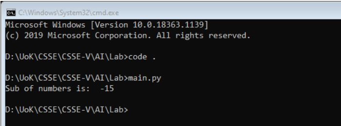

Title: Python Code 1
Date: 2021-04-22 15:46
Category: Python
Authors: Alwi

## Lab Task: Objective
### write a code snippet in python that have number integer `12345` and it checks if the remainder with 2 of this number is even or odd.
### If the remainder is even then the the digits will be added i.e `1+2+3+4+5`
### If the remainder is odd then the digits will be subtracted i.e `-1-2-3-4-5`

## Code:
```Python
num = 12345
if num % 2 == 0:
    sum = 0
    digits = [int(x) for x in str(num)]
    for digit in digits:
    sum += digit
    print("Sum of numbers is: ", sum)
else:
    sub = 0
    digits = [int(x) for x in str(num)]
    for digit in digits:
    sub -= digit
    print("Sub of numbers is: ", sub)
```

## Output:
